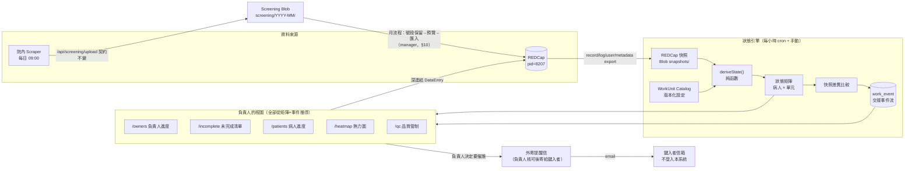
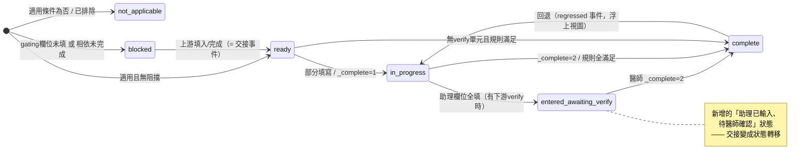

# NTUH OHCA Registry 管理系統重新設計書

> **版本**：v1.1（2026-08-31）
> **委託人**：G03360（資料庫主要負責人）
> **目的**：本文件是「設計交付物」——由另一個 AI model 依此實作。設計目標是在**延續現有 Dashboard 管理模式**的前提下，重建整套人員／進度／交接管理系統。
> **設計方法**：本設計由 5 個獨立設計方案（狀態機優先、人員當責優先、最小演進、設定驅動、理想藍圖）經 3 位不同視角評審交叉評分後，以最高分方案為主幹、嫁接其餘方案的優點合成。
>
> **v1.1 修正的前提**：v1.0 假設十幾位同仁會各自登入 Dashboard 看自己的佇列。**這個假設是錯的**——見 §1.5。Dashboard 是**負責人一個人的監控工具**，其他人只在 REDCap 裡鍵入資料，不會進這個系統。已完成的 Phase 0–3 不受影響（狀態矩陣、目錄、稽核都是算給負責人看的），但 §7 通知模型、§12 頁面、§15 Phase 4–8 依此重寫。

---

## 0. 摘要（TL;DR）

現有 Dashboard 的三大問題——**看不清每個人的進度（問題1）**、**表單之間交接斷鏈（問題2）**、**表單內特定欄位由特定人負責卻無法表達（問題3）**——其實是同一個缺失抽象造成的：**系統裡沒有「某個病人身上、屬於某個人的一件工作」這個概念。**

本設計只引入一個新的核心概念：**WorkUnit（工作單元）**——以「設定」（而非程式碼）宣告的一個工作單位，可以是一整張 REDCap 表單，也可以是表單內的一組欄位（把今日寫死的 5 個 virtual forms 一般化）。每個 WorkUnit 帶有：

- **適用條件**（applicability，如 `sur_icu == '1'` 才適用 Lab ICU）
- **完成規則**（completion rule，如「必填欄位全填」或 `_complete == '2'`）
- **相依邊**（dependencies，如 Core 醫師必須等 Core 助理填完）

一個**純函數**把每次 REDCap 快照轉換成「病人 × 工作單元」的**狀態矩陣**（**6 種基礎狀態**：`not_applicable` / `blocked` / `ready` / `in_progress` / `entered_awaiting_verify` / `complete`，外加獨立的 `flagged` 覆蓋層）；比較前後兩次快照的差異就得到**交接事件**（「Outcome 助理填了 sur_icu=1 → 病人 5123 的 Lab ICU 變成 ready → 浮上負責人的視圖，附一鍵寄信給該做的人」）。

每人／每病人進度、待催辦清單、QC flag 路由、外寄提醒——全部變成同一個矩陣與事件流之上的「視圖」。**REDCap 仍是唯一資料來源與唯一輸入介面；Dashboard 仍是佇列＋深連結；現有側欄的頁面分類全部保留、就地演進。**

**這些視圖只有一位讀者**（§1.5）。系統的產出因此只有兩種形狀：負責人在畫面上看到的東西，以及**直接寄到鍵入者信箱的信**——不是等他們登入才看得到的站內通知。

---

## 1. 現況診斷（設計依據）

三大問題在現有程式碼中的具體根源（完整缺口分析見附錄 C）：

### 問題1：很難管理每個人的進度
- Ownership 只有「一張表單 → 一個 REDCap username」的扁平 map（`src/types/index.ts:89`、`src/lib/owner-store.ts`），無法表達多人分工、分院區、分號段。
- 個人活動與負責人之間用「顯示名稱字串」反查連接（`transform.ts:203-209`，first-match-wins），同名或帳號異動就默默算錯。
- 成績（優/良/待加強/落後）用「累積完成數 ÷ 全域目標」計算，但分子排除不適用病人、分母不排除（`transform.ts:255-260` vs `44-53`），新加入者永遠是「落後」；被上游卡住與偷懶無法區分。
- 鍵入次數把每次存檔都算一次，`formParsed` 算出來卻沒用（`transform.ts:163-174` vs `222-233`）；「本週」實際上顯示一個月（`use-logging-data.ts:6-14`）。
- 沒有任何「病人層級」的進度：管理者看不到「已完整完成 N 位病人」。

### 問題2：表單之間交接斷鏈
- 助理→醫師的交接只是慣例：Core/Outcome 助理完成度是欄位檢查推導（永遠只有 0 或 2，沒有 1），醫師完成度讀同一張表的 `_complete`（`transform.ts:58-77`）——沒有任何訊號告訴醫師「助理填完了，換你」。
- 適用性由**其他角色在更晚階段**填入的欄位決定（Lab ICU/Postarrest 依 Outcome 助理填的 `sur_icu`；Trauma 依 etiology 判讀的 `cause_all_etiology_new`）——新出現的工作沒有人收到通知，在填入 gating 欄位之前，這些工作在所有佇列裡都不存在。
- Etiology 共識→Outcome 死因：綠色但無法 1:1 對映的個案（cause `1-3`）只在批次上傳 modal 出現一次就被遺忘（`etiology/page.tsx:885-896`）。
- QC flag 不路由給任何人（`qc/page.tsx:53` 寫死 `owner:null`），跨表 check 只深連結其中一邊。
- 每月 CSV 匯入 REDCap 是手動往返：手打起始 study_id、沒有匯入確認、沒有防撞號（`monthly/page.tsx:104-125`）。
- 未審核的 Possible_OHCA 病人在月匯出時默默消失；`Manual_Review` 類別完全隱形（`screening/page.tsx:118`）。

### 問題3：表單內欄位分工無法表達
- 唯一的欄位級分工是寫死在程式碼的 5 個 VIRTUAL_FORMS＋必填欄位清單（`forms.ts:38-74`），只覆蓋 core/outcome 兩張表；其餘 26 個單元無法拆分；新增拆分要改程式重佈署；清單已經與註解漂移（`client.ts:137` 的註解 vs `forms.ts:60-62`）。

### 必須延續的優點（設計約束）
1. REDCap 是唯一資料庫，Dashboard 讀多寫少（僅 etiology_final、QC fix 窄範圍回寫）。
2. 「Dashboard 是佇列、REDCap 是編輯器」：每列深連結到正確的 DataEntry 頁。
3. Virtual forms 的助理/醫師拆分機制本身是對的——需要一般化，不是丟棄。
4. 適用性 gating（不是每張表適用每個病人）已被建模——需要可見的 N/A 狀態。
5. 目標批次模型（targetIds → ✓完成/缺N筆卡片）。
6. **Etiology 判讀子系統整套保留**：多 labeler 投票、黃/綠/紅共識、投影模式、RSVP 郵件、批次回寫。
7. Screening 機器擷取＋人工確認的流程與 scraper 上傳契約。
8. 13 條 QC check 目錄（尤其 A 系列跨表一致性檢核）是長年累積的資產。
9. `/api/report/weekly` 與外部 PA 週報 routine 的穩定契約（「PA 端只負責敘述」）。
10. 側欄十頁的管理分類法；優/良/待加強/落後 的詞彙。
11. 快取分層與可見的資料新鮮度（更新時間戳、手動重新抓取）。
12. 排除語意（exclusion）與三院區群組心智模型（生醫/竹東→新竹、斗六/虎尾→雲林）。

### 1.5 使用模型（v1.1 修正的核心前提）

**Dashboard 只有一位使用者：資料庫負責人。** 其他十幾位同仁在 REDCap 裡鍵入資料，不會登入這個系統、不會看站內通知、不會有自己的頁面。

這不是規模問題而是形狀問題，它決定了幾件事：

| v1.0 的假設 | 實際情況 | 設計後果 |
|---|---|---|
| 每人登入看自己的 `/me` 佇列 | 沒有人會登入 | 佇列是**負責人**的視圖，可依人篩選；不需要每人一頁 |
| 站內鈴鐺 + 未讀通知 | 沒有收件者 | 移除。`notification` 表改為**外寄信件流水帳**（§7） |
| 每日 digest 推給每個人 | 唯一能觸達他們的通道是 email，而且已經有一條（共識會議提醒信） | 提醒仍然寄，但**寄給鍵入者本人**、沿用同一條通道，並且是負責人決定要不要寄 |
| QC flag 由被指派人認領／豁免 | 他們看不到 flag | flag 路由的用途是**告訴負責人該找誰**；認領與豁免是負責人的動作 |
| 角色分五級控制各自能做什麼 | 只有一個人操作 | 角色模型保留在程式裡但實務上只用 `manager`；magic link 是負責人自己的登入方式（比共用密碼好：不用記密碼、稽核記真名） |

**不變的部分**：問題1（進度管理）與問題3（欄位分工）的解答完全不受影響——它們本來就是算給負責人看的。問題2（交接斷鏈）的**偵測**不受影響（狀態機照樣算得出「這件事現在可以動工了、已經卡了 12 天」）；改變的是**送達方式**：從「系統通知當事人」變成「負責人看見後決定要不要催，系統幫他把信寄出去」。

---

## 2. 設計總覽



儲存層分工（新增一個小型 Postgres，**只放管理中繼資料，絕不放臨床資料**）：

| 儲存 | 放什麼 | 理由 |
|---|---|---|
| REDCap | 全部臨床資料（不變） | 唯一資料來源 |
| Postgres（Vercel/Neon） | person、assignment_rule、work_event、qc_flag、outbound_mail、audit_log、batch、study_id_reservation、screening_case_link、etiology_meeting、report_delivery、login_token、catalog_version | 需要交易、唯一性約束、範圍查詢、append-only 歷史 |
| Redis | catalog（現行版）、metadata cache、matrix cache、snapshot 指標 | 熱讀、小、現有基礎設施 |
| Vercel Blob | 快照原始檔、catalog 歷史版本、scraper 每日檔（契約不變） | 大檔、不可變歷史 |

> **設計決策**：評審指出「catalog 在 Redis、其餘在 Postgres 是不必要的雙腦」。裁決：**catalog 現行版仍放 Redis**（單一 key、每次推導都要讀、與現有 app-state 同處），但**每次存檔同步寫一份到 Postgres `catalog_version` 表**（id, version, doc jsonb, updated_by, updated_at）作為權威歷史與 Blob 的備援——Redis 遺失時從 Postgres 最新版重建。這消除雙腦風險又保住熱讀路徑。

---

## 3. 身分與稽核（Identity & Audit）

### 3.1 person（人員登記表）——統一三套身分

現況有三套互不相通的身分：REDCap username、etiology labeler code（0/3/5/6/7）、以及**沒有個人身分**的網頁層（兩組共享密碼）。統一為一張表：

```sql
CREATE TABLE person (
  id               uuid PRIMARY KEY DEFAULT gen_random_uuid(),
  redcap_username  text UNIQUE,          -- 可為 NULL（純 labeler、PA）
  labeler_code     smallint UNIQUE,      -- ntuh_nhi_etiology 的 labeler 下拉碼，可為 NULL
  display_name     text NOT NULL,
  email            citext UNIQUE NOT NULL, -- 由 REDCap user export 的 email 種入（現行程式在 api/owners/route.ts:18-21 把它丟掉了）
  roles            text[] NOT NULL,      -- ⊆ {manager, doctor, abstractor, labeler, viewer}
  broadcast_opt_out boolean NOT NULL DEFAULT false, -- 取代寫死的「陳雲昶」字串排除（etiology/page.tsx:167）
  notify_pref      text NOT NULL DEFAULT 'digest',  -- v1.1：只剩「會不會收到催辦信」的意思；'off' = 不寄，其餘皆寄
  active           boolean NOT NULL DEFAULT true,
  created_at       timestamptz NOT NULL DEFAULT now()
);
```

- **全系統一律以 `person.id` join**；顯示名稱只做呈現。徹底移除顯示名稱反查（`transform.ts:203-209`）與 F1 用 username、F2 用顯示名稱的不一致。
- 種子資料：REDCap user export（username、姓名、email）一鍵匯入 + 手動補 labeler 與 PA；labeler_code 在 /admin 人員頁連結。

### 3.2 登入：email magic link（免密碼）

- `POST /api/auth/request-link {email}`：email 屬於 active person 才寄出 15 分鐘一次性簽章連結（HMAC-SHA256，新增環境變數 `SESSION_SECRET`；沿用既有 nodemailer/Gmail 通道）。永遠回 204（防帳號枚舉）。**一次性的實作機制**：token 含 `jti`，Postgres `login_token (jti PRIMARY KEY, person_id, expires_at, used_at)`——callback 時 `used_at IS NULL` 才接受並標記已用（純簽章無法防 15 分鐘內重放）。
- `GET /api/auth/callback?token=`：設 `session` cookie = JWT `{personId, roles, exp 30d}`，HttpOnly、SameSite=Lax。
- `src/proxy.ts`（**Next 16 是 proxy 不是 middleware**——實作前必讀 `node_modules/next/dist/docs/01-app/01-getting-started/16-proxy.md`）驗證簽章；**遷移期同時接受舊 user_token/admin_token cookie**，對映到合成人員 `legacy-shared`，第一天什麼都不壞。
- **v1.1**：magic link 是**負責人自己**的登入方式，不是要推給十幾個人的東西（§1.5）。它相對共用密碼的好處有兩個：不用記密碼，以及稽核列記的是真名而不是 `legacy-shared-admin`。因此 `LEGACY_AUTH=off` 不是「等全員上車」的里程碑，而是負責人自己覺得可以退役共用密碼時的一個開關。
- 散落 5 處的 inline admin 檢查已收斂到 `requireRole()` 一個模組（Phase 1 完成）；DJB2 雜湊路徑與無效的 OTP 殘骸（`use-admin-auth.ts:75-116`）在 `LEGACY_AUTH=off` 之後即可刪除。
- 機器身分不變：`SCREENING_API_TOKEN`（scraper）、`REPORT_API_TOKEN`（PA 週報）維持 Bearer token 並在 proxy matcher 豁免。

### 3.3 角色權限

| 角色 | 權限 |
|---|---|
| viewer | 讀所有儀表板 |
| abstractor / doctor / labeler | viewer + RSVP |
| manager | 全部：catalog/規則/人員/批次、screening 判定、etiology_final 回寫、QC 豁免與批次修正 |

每個 mutating API route 以單一 helper `requireRole('manager')` 伺服器端檢查。

**v1.1**：實務上只有 `manager` 在用（§1.5）。角色模型保留有兩個理由——它已經實作完成且有測試，而且它讓「有 REDCap 帳號」與「能對 REDCap 回寫」是兩件事，這在只有一個人操作時依然是對的預設。`person.roles` 的其餘四級目前是未使用的容量，不是待完成的工作。

### 3.4 audit_log（全稽核）

```sql
CREATE TABLE audit_log (
  id               bigserial PRIMARY KEY,
  ts               timestamptz NOT NULL DEFAULT now(),
  actor_person_id  uuid REFERENCES person,   -- 機器行為時為 NULL
  actor_token_name text,                     -- 'scraper' | 'pa-weekly' | 'cron'
  action           text NOT NULL,            -- 'assignment_rule.create' | 'qc_flag.waive' | 'etiology_final.write' | 'screening.review' | 'study_id.reserve' | ...
  entity_type      text NOT NULL,
  entity_id        text NOT NULL,
  before           jsonb,
  after            jsonb
);
```

- **每個 mutating route 在同一交易寫一列**。
- REDCap 回寫另存 import payload hash——「誰在何時把 5123 的 etiology_final 設成 7」終於可以回答。
- Screening 判定記錄 `decided_by = personId`（修正現行匿名 `{decision, reviewedAt}`）。
- `/admin/audit`（新頁，manager only）可篩選檢視。

---

## 4. WorkUnit Catalog（工作單元目錄）——問題3 的解答

### 4.1 概念

**指派掛在 WorkUnit 上，不是掛在 REDCap 表單上。** WorkUnit 可以是整張表單，也可以是表單內的欄位群組——所以「某表單的某些欄位由特定人負責」= **在設定裡建一個單元**，永遠不必寫程式。今日的 5 個 VIRTUAL_FORMS 變成 catalog 裡 5 筆 `field_group`/`verify` 類型的資料；明天想拆「Discharge 護理欄位」，就是管理者在 `/admin` 編輯 catalog，存檔時以同步的 REDCap data dictionary 驗證（欄位必須存在於指定 instrument）。

### 4.2 結構

單一版本化 JSON 文件。現行版：Redis key `catalog:units`；歷史：Blob `catalog/units/{ISO-ts}.json` + Postgres `catalog_version`（見 §2 設計決策）。

```jsonc
{
  "version": 42,
  "updatedBy": "<personId>",
  "units": [
    {
      "unitId": "core.assistant",            // 穩定識別碼
      "label": "Core 助理",
      "redcapForm": "ntuh_nhi_core",         // 實體 instrument
      "deepLinkPage": "ntuh_nhi_core",       // 深連結頁（一處解決 virtual→real 對映）
      "kind": "field_group",                 // full_form | field_group | verify | adjudication | derived_field
      "completionRule": {
        "type": "required_fields",
        "variants": [
          { "when": "er_arrival == '0'",
            "fields": ["place_core","witnessed_core","bystander_core","pad_core","manual_core","mcc_core","aed_core","airway_core","bosmin_core","emt_core","emtp_core","prehos_rosc_core"],
            "checkboxFields": ["airway_core"] },
          { "when": "else", "fields": ["prehos_rosc_core"] }
        ]
      },
      "applicability": { "expr": "true", "gatingFields": [] },
      "dependencies": [],
      "category": "basic",
      "defaultTarget": 6000,
      "sortOrder": 5
    },
    {
      "unitId": "core.doctor",
      "kind": "verify",
      "completionRule": { "type": "complete_field", "completeField": "ntuh_nhi_core_complete" },
      "dependencies": [ { "unitId": "core.assistant", "type": "verify_after" } ]
      // ...
    },
    {
      "unitId": "lab_icu",
      "kind": "full_form",
      "applicability": {
        "expr": "sur_icu == '1'",
        "gatingFields": [ { "field": "sur_icu", "enteredByUnit": "outcome.assistant" } ]
      }
      // ...
    }
    // ... 完整種子清單見下表
  ],
  "checks": [ /* QC check 目錄，見 §8 */ ],
  "settings": { "staleDays": 14, "gradeThresholds": [90, 60, 30] }
}
```

**種子單元權威清單（共 34 個單元）**：`forms.ts` 的 33 筆中，32 筆 1:1 轉入；`ntuh_nhi_etiology` 改種為 adjudication 單元 `etiology.vote`（沿用其 target/sortOrder）；另**新增** `patient.screening`。

> **對正式 schema 校正過（2026-08）**：`ntuh_exam_holtertreadmill` 已移除——REDCap 沒有這個 instrument，其 `_complete` 對全部 7,169 筆記錄皆為空，該表永遠停在 0/1000；Holter 與 treadmill 實際上是 `ntuh_nhi_examcheck` 的兩個 radio 欄位。同時納入 REDCap 有但先前未追蹤的三個 instrument：`ntuh_nhi_ed_vital`、`ntuh_nhi_postarrest_vital`、`ntuh_exam_ct`。

單元可加 `hidden: true` 旗標（取代現行 hiddenForms，見 README 的「尚未開始鍵入的表單」）：隱藏單元不出現在熱力圖欄、佇列與任何分母，但 `/api/state/matrix?includeHidden=1` 仍可取得。

| unitId | kind | redcapForm | 來源 |
|---|---|---|---|
| ntuh_nhi_patient、ntuh_nhi_basic_info_38971b、ntuh_nhi_predisease、ntuh_nhi_preohca_hos_use、ntuh_nhi_core_cpr、**ntuh_nhi_ed_vital**、h14trauma_ohca_transfusion、ntuh_nhi_lab_ed、ntuh_nhi_lab_icu、**ntuh_nhi_postarrest_vital**、ntuh_nhi_postarrest_care、ntuh_nhi_examcheck、ntuh_nhi_discharge、h6_validation_add、h12_ed_manage_short_outcome、ntuh_nhi_environment、h20_mtdna | full_form（`complete_field` 規則，共 17） | 同名 | forms.ts 1:1 |
| ntuh_exam_cag、ntuh_exam_ucg、ntuh_exam_abd_echo、ntuh_exam_pes、ntuh_exam_colon、ntuh_nhi_op、ntuh_exam_patho、ntuh_exam_lft_2、ntuh_exam_eeg、**ntuh_exam_ct** | full_form（category: exam，共 10） | 同名 | forms.ts 1:1 |
| core.assistant | field_group | ntuh_nhi_core | forms.ts 虛擬單元轉入 |
| core.doctor | verify（`ntuh_nhi_core_complete`） | ntuh_nhi_core | forms.ts 虛擬單元轉入 |
| outcome.assistant | field_group | ntuh_nhi_outcome | forms.ts 虛擬單元轉入 |
| outcome.doctor | verify（`ntuh_nhi_outcome_complete`） | ntuh_nhi_outcome | forms.ts 虛擬單元轉入 |
| outcome.etiology | derived_field（`etiology_final`） | ntuh_nhi_outcome | forms.ts 虛擬單元轉入 |
| etiology.vote | adjudication | ntuh_nhi_etiology（repeat） | forms.ts 的 ntuh_nhi_etiology **改型** |
| patient.screening | field_group（僅 `exclusion` 欄） | ntuh_nhi_patient | **新增**（§6.2 步驟 0 的責任單元） |

（統計：`complete_field` 27 個 = 17 basic full_form + 10 exam；field_group 3；verify 2；derived_field 1；adjudication 1，合計 34。）

### 4.3 適用性表達式（applicability expr）

刻意極小的表達式語言：欄位比較 `==`、`!=`、`in`，布林 `&&`/`||`，加 `studyIdNum` 與 `batch('<slug>').cutoff` 函數（batch 表含 `slug` 唯一鍵，見 §9.3；**引用不存在的 slug → 結果 UNKNOWN → blocked**，blockReason `awaiting_config`，在 /admin 顯眼警示）。**三值邏輯**：gating 欄位為空 → 結果 UNKNOWN（不是 false）→ 狀態為 `blocked` 而非 `not_applicable`。

**求值時的記錄扁平化**：expr 求值於聚合後的記錄視圖——`_complete` 欄位取 MAX（同現行）；其餘欄位預設取主列（non-repeat row）值；gatingFields 可標注 `aggregation: 'any'` = 任一 repeat row 等於目標值即成立。**trauma 的 gating 必須標 `aggregation:'any'`**（`cause_all_etiology_new` 活在 ntuh_nhi_etiology 的 repeat 投票列上，現行語意是「任一 labeler 投 1 即適用」，`client.ts:191-206`）——不標會把所有病人求成 UNKNOWN。

種入值：

| 單元 | expr | gating 欄位（由誰填） |
|---|---|---|
| ntuh_nhi_lab_icu、ntuh_nhi_postarrest_vital、ntuh_nhi_postarrest_care | `sur_icu == '1'` | sur_icu（outcome.assistant，主列） |
| h14trauma_ohca_transfusion | `cause_all_etiology_new == '1'` | cause_all_etiology_new（etiology.vote，`aggregation:'any'`） |
| h20_mtdna | `true`（**與現行 1:1**——現行程式對所有病人適用 mtDNA；未來要限縮再由 G03360 在 /admin 改成 `studyIdNum <= batch('mtdna').cutoff` 並建立 slug=mtdna 的批次） | — |
| 其他 | `true` | — |

**防呆**（管理者可能改壞設定）：存檔前強制 dry-run 影響差異（「此變更會翻轉 N 個 cell 的狀態」）、schema + metadata 驗證、相依圖循環偵測、版本歷史一鍵回滾。

### 4.4 已知漂移的處置

`client.ts:137` 註解宣稱非到院前的必填集是 `tohospital_core + prehos_rosc_core`，但 `forms.ts:60-62` 只有 `prehos_rosc_core`。**種子腳本把兩個候選版本都呈現為 catalog diff，由 G03360 在 /admin 按一下裁決**——把埋在過期註解裡的決策變成可見的設定。

---

## 5. 指派模型（Assignment Rules）——多人、分區、分段

取代 `owner-store` 的扁平 form→username map：

```sql
CREATE TABLE assignment_rule (
  id             uuid PRIMARY KEY DEFAULT gen_random_uuid(),
  unit_id        text NOT NULL,
  hospital_group text,              -- '總院'|'新竹'|'雲林'|NULL=全部
  study_id_from  int,               -- NULL = 不限
  study_id_to    int,
  person_ids     uuid[] NOT NULL CHECK (cardinality(person_ids) >= 1),
  mode           text NOT NULL DEFAULT 'pool',  -- 'pool' | 'modulo'
  active         boolean NOT NULL DEFAULT true,
  created_by     uuid NOT NULL REFERENCES person,
  created_at     timestamptz NOT NULL DEFAULT now(),
  superseded_by  uuid REFERENCES assignment_rule  -- append-only：取代、不更新 → 免費歷史
);
```

- **解析規則**（給定 studyId, unitId, hospitalGroup）：取該 unit 的 active rules；特異度 = (有號段 ? 2 : 0) + (有院區 ? 1 : 0)；最高分勝出；平手取最新。無符合 → `未指派` bucket（保留概念，但在 /owners 變成**可行動**：一鍵開啟預填好的規則表單）。
- `pool`：清單中任何人都可做任一符合項（進度歸屬見 §9 的實際操作者歸屬）。`modulo`：`person_ids[studyIdNum % len]` 決定性分工——不需要「認領」功能就有公平分配。
- **個人 credit 不再來自指派**：來自 REDCap log 的實際操作者（§9）——共享表單終於能正確歸屬。
- Etiology：labeler 掛在 `etiology.vote` 單元的 pool 規則上；共識門檻移入 catalog `consensusRule: {minVotes: 3, allowSingleDissenter: true, dissenterMajorityMin: 3}`（預設值 = 現行寫死值）。
- **變更前影響預覽**：存規則前顯示「此變更把 N 個未完成項從 A 改派給 B」（以現行矩陣計算）。
- **變更即留痕（v1.1 修正）**：規則異動寫入稽核與 `assigned` 事件，受影響項目在 /owners 標示「本週改派」。不自動寄信——被指派人本來就看不到系統（§1.5），改派對他有意義的時刻是負責人下一次寄清單給他的時候（修正現行 /assign 改完連負責人自己都無從回顧的問題）。

---

## 6. 狀態機（State Machine）——問題2 的解答

### 6.1 狀態

每個（病人 r × 單元 u）恰好一個基礎狀態 + flagged 覆蓋層。**狀態永不儲存、永遠從 REDCap 快照推導**——REDCap 保持權威，結構上不可能漂移。



> 狀態**逐快照全量重新推導**，圖示為常見前向路徑；資料回退（gating 欄位被清空、相依單元回退、exclusion 改動）可在**任意狀態對之間**產生轉移，對應 `became_blocked` / `became_na` / `regressed` 事件（§6.3）。

### 6.2 推導順序（`deriveState(r, u, snapshot, flags)` 純函數）

0. **排除判定**：`r.exclusion ∉ {'', '0'}` → 全部單元 `not_applicable`（原因 excluded），離開所有分母（現行行為保留）。`r.exclusion === ''` → 記錄**納入**但標記 `screeningPending=true`，進入新的「**排除判定待完成**」bucket，責任單元為 `patient.screening`（覆蓋 `ntuh_nhi_patient.exclusion` 欄位的 field_group）——修正「沒人判定過的記錄被當成有效 OHCA」（`transform.ts:40`）。
1. **適用性**：三值評估 expr。gating 欄位為空 → `blocked`，blockReason `{kind:'awaiting_gate', field:'sur_icu', enteredByUnit:'outcome.assistant'}`——「還不知道適不適用」與 N/A、與落後，三者可見地不同（修正熱力圖把 N/A 畫成紅色的謊言，`completion-heatmap.tsx:95`）。expr false → `not_applicable`。true → 續。
2. **相依**：`verify_after`：verify 單元被擋直到來源單元達 `entered_awaiting_verify`（例外見規則 3 的 verify 條目）。`data_gate`：來源單元 `state == complete` 才解除——**種子不含任何 data_gate 邊**，此類型保留給 G03360 未來在 catalog 編輯器手動加邊用。`soft_order` 永不阻擋，只排序佇列。被擋 → `blocked`，blockReason `{kind:'awaiting_unit', unitId}`。（catalog 驗證器拒絕循環。）
3. **完成規則**（依類型）：
   - `complete_field`（一般表單，27 個，見 §4.2 種子表）：`_complete=='2'`→complete；`'1'`→in_progress；`'0'`/缺→ready。Repeat instrument 沿用 MAX 聚合（相容性決策，見 §14 已知限制）。
   - `required_fields`（欄位群組，如 core.assistant / outcome.assistant）：0 欄填→ready；部分→in_progress；**全填**→有下游 verify 單元未完成時為 `entered_awaiting_verify`，否則 complete；配對 verify 單元完成時→complete。**這就是缺失的「助理已輸入、待醫師確認」狀態**；醫師得到明確觸發：core.doctor 被擋到 core.assistant 達 entered_awaiting_verify 才變 ready——**交接是狀態轉移，不是默契**。
   - `verify`（core.doctor / outcome.doctor）：blocked → 來源 entered 後 ready → `_complete=='1'` in_progress → `'2'` complete。完成後欄位被改或 _complete 回退 → 引擎發 `regressed` 事件（浮上 /owners 與該病人的時間軸）。**優先權例外（與統計相容的明確決策）**：verify 單元若 `_complete=='2'`，**完成規則優先於相依檢查**——狀態為 `complete` 並由 A0 逆序查核（§6.4）開 flag，而**不是** blocked。醫師先簽核的個案在統計上維持與現制一致（今日算 complete），違規以 flag 呈現而非以狀態懲罰。
   - `derived_field`（outcome.etiology / Outcome 死因）：`etiology_final ≠ ''` → complete；否則共識為綠且可對映 → ready（等批次上傳）；否則 `blocked {kind:'awaiting_consensus'}`。
   - `adjudication`（etiology.vote）：票數 < minVotes → in_progress（黃）；綠但 final 未寫 → entered_awaiting_verify（待批次上傳）；**綠但不可對映（cause '1-3'）或紅 → entered_awaiting_verify 加子原因 `needs_manual_map` / `needs_meeting`——終於有持久佇列**（修正被遺忘的「需手動處理」modal）；final 寫入 → complete。
4. **flagged 覆蓋層**：路由到 (r,u) 的 open QC flag 設 `flagged=true`，不改變基礎狀態；UI 畫徽章、佇列可篩選。「已完成但被 QC 標記」從此可表達。

### 6.3 交接事件（work_event）

Vercel cron（**每小時**，另有手動「重新抓取」）：取 REDCap 快照 → 存 Blob → 推導整個矩陣 → 與前一矩陣 diff → append `work_event`：

```sql
CREATE TABLE work_event (
  id           bigserial PRIMARY KEY,
  ts           timestamptz NOT NULL,
  snapshot_ts  timestamptz NOT NULL,
  study_id     text NOT NULL,
  unit_id      text NOT NULL,
  event_type   text NOT NULL,  -- became_ready | became_blocked | entered_awaiting_verify | completed | regressed | became_na | flag_opened | flag_resolved | assigned | nudged
  from_state   text,
  to_state     text,
  cause        jsonb,          -- 例 {"field":"sur_icu","from":"","to":"1"}
  routed_person_ids uuid[]
);
CREATE INDEX ON work_event (study_id);
CREATE INDEX ON work_event (unit_id, ts);
CREATE INDEX ON work_event (event_type, ts);
```

- `became_ready` 是**交接訊號本體**（含成因，如 gating diff `sur_icu '' → '1'`），以事件當下的指派解析算出 `routed_person_ids`——**該找誰**，供視圖標示與催辦信引用（§7.1）。v1.1：不物化成站內通知，沒有收件者。
- **佇列本身永遠從最新矩陣即時推導**——事件只是「新東西」的增量層，漏掉事件不可能弄丟工作（項目仍在佇列裡）。
- 涵蓋缺口分析裡每一條隱形交接，只是「送達」改成 v1.1 的形狀（§1.5）：助理填完 → 醫師名下多出「N 位病人待確認」且負責人看得到它在變老；Outcome 助理填 sur_icu=1 → Lab ICU/Postarrest 名下多出「N 筆新適用個案」；etiology 判讀翻轉 Trauma 適用性 → 同上；共識綠批次上傳 → outcome.etiology 自動 complete。每一條都是負責人視圖上的一列與一顆「提醒」鈕，而不是一封自動寄出的信。

### 6.4 逆序查核（A0，嫁接自「人員當責」方案）

狀態機會擋住醫師單元直到助理完成，但**醫師直接在 REDCap 把 `_complete` 設成 2 是擋不住的**（REDCap 端無法強制）。新增 QC check **A0 逆序查核**：verify 單元 `_complete='2'` 而其上游助理欄位群組未達完成 → warning flag，routed 標記該醫師（該找誰）、呈現給負責人。一條 catalog 設定就把「軟性流程約束」變成可見、可路由的 flag。

---

## 7. 提醒模型（v1.1 重寫）

v1.0 這一節設計的是「站內鈴鐺 + 每人每日 digest」。**沒有收件者**——鍵入者不登入這個系統（§1.5）。整節依實際使用模型重寫。

原則：**佇列是真相**（即時推導、不會漏，而且只要負責人打開頁面就看得到）；**email 是唯一能觸達鍵入者的通道**，因此每一封都是負責人有意識寄出的，不是系統自己決定的。

### 7.1 觸達鍵入者的唯一形狀：email

系統**不會**自動對鍵入者發信。所有外寄提醒都經過負責人，只是負責人不必自己寫信：

| 情境 | 觸發者 | 內容 |
|---|---|---|
| 共識會議提醒 | 負責人在 `/etiology` 按下（**現行流程原樣保留**，含簽章 RSVP 連結） | 該 labeler 未判讀的 studyId 清單 + 會議時間 + RSVP |
| 單人催辦 | 負責人在 `/owners` 任一列按「提醒」 | 該人目前 ready / awaiting-verify 的清單、最老幾天、每筆 REDCap 深連結 |
| 批次到期 | 負責人在批次頁按「通知相關人」 | 該批次剩餘工作與到期日 |

三者共用同一個信件產生器與同一條 Gmail/nodemailer 通道。群發的排除對象由 `person.broadcast_opt_out` 決定（取代寫死的姓名字串）。

**為什麼不自動寄**：自動化的收益是「不必記得催」，成本是收件者開始忽略這個寄件人。在只有負責人能判斷「這個人這週在開刀房、不用催」的情況下，成本大於收益。系統負責讓「該催誰」一眼可見，按不按由人決定。

### 7.2 負責人怎麼知道該催誰：不是通知，是視圖

取代站內通知的是三個**每次打開都重新推導**的訊號，不需要已讀狀態、不會漏、不需要基礎設施：

- **新交接**：`/owners` 與 `/incomplete` 標出「最近一次快照才變成 ready」的項目（由 `work_event` 推導，預設看 7 天內）。這就是 v1.0 想用 `handoff_ready` 通知表達的事，只是改成一個永遠正確的篩選條件而不是一列一列的未讀記錄。
- **aging**：`oldestReadyDays` 讓停滯自己浮出來（§9.1）。通知會被無視，排序不會。
- **停滯 × 落後 兩軸**：`velocity_14d == 0` 與成績正交（§9.1），一眼分出「落後但有在做」與「落後且停工」。

### 7.3 需要主動打斷負責人的事：只有一種

負責人也不是隨時盯著畫面。**唯一值得主動寄信給負責人自己的，是「系統本身沒在運作」**——因為這種事不會出現在任何佇列裡（沒有資料，也就沒有落後的項目）：

- **`scan_missing`**：某院區當日 scraper 檔案在期望掃描時間（09:00）後 N 小時（預設 6，可設定）仍未上傳 → 寄給負責人。補救仍是院內手動重跑，但**不再靠有人剛好看到徽章**。
- **快照失敗**：連續兩次快照 cron 失敗 → 寄給負責人。狀態矩陣停止更新時，畫面看起來和「大家都沒進度」一模一樣，這是最危險的失效模式。

兩者都以「事件 × 日」去重，一天最多一封。

### 7.4 `outbound_mail`：寄了什麼、寄給誰、寄出去沒有

v1.0 的 `notification` 表（含 `read_at` 收件匣語意）改為單純的外寄流水帳：

```sql
CREATE TABLE outbound_mail (
  id            bigserial PRIMARY KEY,
  to_person_id  uuid REFERENCES person,     -- 寄給負責人自己時為 NULL
  to_email      text NOT NULL,              -- 寄出當下的實際位址（person 之後改 email 也不影響歷史）
  kind          text NOT NULL,              -- meeting_reminder | nudge | batch_due | scan_missing | snapshot_failed | login_link
  payload       jsonb NOT NULL,             -- {studyIds, unitId, meetingDate, …}
  requested_by  uuid REFERENCES person,     -- 按下按鈕的人；系統自動寄出時為 NULL
  sent_at       timestamptz,                -- NULL = 送出失敗
  error         text,
  created_at    timestamptz NOT NULL DEFAULT now()
);
CREATE INDEX ON outbound_mail (to_person_id, created_at DESC);
CREATE INDEX ON outbound_mail (kind, created_at DESC);
```

這張表回答三個現行系統答不出來的問題：**這個月催過他幾次**（避免同一週催兩次）、**上次提醒信到底寄出去了沒有**（現行只有一個全域 `reminderSentAt` timestamp，寄失敗看不出來）、以及**這個 labeler 的提醒歷史**（取代單一全域時間戳）。`/admin` 直接列出它。

### 7.5 刻意維持手動

screening 每日人工判定、召開共識會議的決定、批次建立、任何 REDCap 回寫——系統負責呈現與路由，人負責決定。這一條在 v1.1 反而更強：**外寄提醒也加入這個清單**。

---

## 8. QC 路由與生命週期

### 8.1 flag 持久化

```sql
CREATE TABLE qc_flag (
  fingerprint   text PRIMARY KEY,   -- checkId + ':' + studyId
  check_id      text NOT NULL,
  study_id      text NOT NULL,
  status        text NOT NULL,      -- open | acknowledged | waived | resolved
  first_seen_at timestamptz NOT NULL,
  last_seen_at  timestamptz NOT NULL,
  value_hash    text NOT NULL,      -- sha256(涉及欄位值 tuple)
  routed_unit_ids     text[] NOT NULL,
  assignee_person_ids uuid[] NOT NULL,
  waived_by     uuid REFERENCES person,
  waive_reason  text,
  resolved_at   timestamptz
);
```

生命週期：每次快照跑 QC evaluator——
- check 命中：upsert（新 → `open` + `flag_opened` 事件；既有 → 更新 last_seen_at；**若 `value_hash` 變了而狀態是 `waived` → 自動 REOPEN**——豁免一個確實急救很久的 E1 個案會一直有效，直到底層資料真的改變）。
- check 不再命中而 flag 仍 open → `resolved` + `flag_resolved` 事件（自動關閉，零人工記帳）。
- `acknowledged` =「看到了、會修」（取代一次 reload 就消失的 client-side lastVisited）。
- `waive` 需 manager + 必填理由，入稽核。

**v1.1**：`assignee_person_ids` 保留，但它的用途是**告訴負責人該找誰**（以及催辦信要寄給誰），不是給被指派人自己認領——他們看不到 `/qc`（§1.5）。acknowledge 與 waive 都是負責人的動作。

### 8.2 路由

catalog 的每條 check 定義增加 `responsibleUnits`（有序 unit id 清單；主要責任在前）。**以單元（不是 raw instrument）作路由鍵**，舊的 virtual↔real 名稱錯配消失：A1 路由到 `[core.assistant, outcome.assistant]`。**跨表 A 系列 check 的 UI 同時呈現兩邊的深連結**（修正「只連到問題的一半」）。

**行為類 check（F1/F2）不入 `qc_flag` 表**（該表以 `checkId:studyId` 為指紋、無 person 鍵）：F1/F2 為**短暫值**——每次快照重算、只呈現在 /owners（不混入 /qc 記錄級清單），不持久化、無生命週期。v1.1：不寄信，只在 /owners 顯示——它們是「這個人最近的鍵入行為看起來不對勁」的提示，該不該追是負責人看了才知道的事。

### 8.3 修正與門檻

- B1 批次修正保留，但：僅 manager（修正現行 `qc/fix` 完全無驗證）；**dry-run + confirm-hash 兩段式協定**（嫁接自理想藍圖方案）：第一次呼叫回傳 diff（記錄 + before/after）與其 sha256 hash；執行呼叫**必須帶上該 hash**，伺服器重算比對，不一致（資料在預覽後變了）→ 拒絕。每次執行入稽核（含完整 payload）。可修 check 清單只活在伺服器端（`GET /api/qc/fixables`）。
- 門檻值（E1 180 分鐘、F1 30 筆/10 分、F2 14 天）移入 catalog settings，現值為預設。
- **修補 F1/F2 語意盲點**：F1 改為回報視窗內**所有** burst（移除每人一筆的 break）；F2 改為純粹以「該 person 最近活動時間」判定（獨立於 grade——現行「成績好就不檢查停工」的漏洞移除），log 視窗外無活動者顯示「> 90 天或無紀錄」而非默默不標。
- C1 維持停用並在 catalog 註明原因（er_arrival 是類別碼非時間戳）；E2 編號空缺在 catalog 註明「歷史編號跳號，非遺失」。

---

## 9. 進度模型——問題1 的解答

同一個矩陣 + 事件流，三個縮放層級：

### 9.1 每人（/owners 演進）

每人每指派範圍顯示：

| 指標 | 定義 |
|---|---|
| readyCount | 可動工的待辦（真正的積壓） |
| inProgressCount / awaitingVerifyCount | 進行中／（醫師的）待確認積壓 |
| blockedCount | **明確不是他的錯**——灰色顯示、不計入成績 |
| flaggedCount | 被 QC 標記數 |
| completedTotal / applicableTarget | 完成 ÷ **適用**目標 |
| oldestReadyDays | 最老 ready 項目的天數（真正的「落後」訊號） |
| completedThisWeek、medianTurnaroundDays | 由 work_event 配對（ready→complete）計算 |
| lastRedcapActivity | REDCap log 以 `redcap_username` join（不再用顯示名稱） |

**成績修正**：保留 優/良/待加強/落後 詞彙與 90/60/30 門檻，但 `pct = complete ÷ 適用 cell 數（active batches 內）`——分子分母終於同一母體；blocked 與 N/A 排除於分母；**落後另須 `oldestReadyDays > staleDays`**（catalog settings，預設 14）——被上游卡住的人與剛接手新表的人不再顯示為懶惰。**助理單元的 `entered_awaiting_verify` 對助理計為已完成工作**（分子計入）——助理的成績不因醫師簽核速度而波動（新舊完成語意對照表見 §15 Phase 3）。

**停滯/進行中 軸（嫁接自人員當責方案）**：與成績正交的活動旗標——`velocity_14d == 0` → 停滯。管理者一眼區分「落後但有在做」與「落後且停滯」。零新儲存，從事件流推導。

**Credit 歸屬**：共享/pool 單元的完成數歸給 REDCap log 中最後存檔該 record+form 的實際操作者（log 以既有但未用的 `formParsed` 依表單 join，`transform.ts:163-174`）；無法歸屬的誠實顯示「無法歸屬」而非默默算錯。

**被擋住反向分組（嫁接自最小演進方案）**：/owners 的鑽取頁提供「**依擋住者分組**」視圖——「30 筆被擋住：22 筆等王OO 的 sur_icu、8 筆等 etiology 共識」。這是負責人「該去催誰」最快的一張視圖，也是「提醒」鈕最該出現的位置（§7.1）。

**v1.1：每一列都要看得到「上次催他是什麼時候」**——由 `outbound_mail` join 得出（§7.4）。沒有這一欄，同一週催兩次或整個月忘記催都不會被察覺。

### 9.2 每病人（新增 /patients、/patients/[studyId]）

- `patientProgress = 完成的適用單元 ÷ 全部適用單元`；phase chip 由里程碑單元推導（基本 → 檢查 → 判讀 → 結案）。
- /dashboard 頭條加「**完整完成病人數 N / 6000**」（放在既有 cell 比例旁）。
- 單一病人頁：34 個單元（§4.2 種子表）的 pipeline、狀態、阻擋原因、負責人、事件時間軸、每單元深連結——**第一次能看到一個病人的完整旅程**。

### 9.3 批次（一般化 targetIds）

```sql
CREATE TABLE batch (
  id              uuid PRIMARY KEY DEFAULT gen_random_uuid(),
  slug            text UNIQUE NOT NULL,   -- 供 applicability expr 的 batch('<slug>') 引用，例 'basic'、'exam'
  name            text NOT NULL,          -- 例「基本表單 batch 3」
  unit_ids        text[] NOT NULL,
  study_id_cutoff int NOT NULL,
  due_date        date,
  created_by      uuid NOT NULL REFERENCES person,
  created_at      timestamptz NOT NULL DEFAULT now(),
  closed_at       timestamptz
);
```

TargetProgress 卡片照舊（✓完成 / 缺 N 筆 + 深連結），分母改用適用性。現行兩個 targetIds 自動遷移為 slug `basic` / `exam` 兩個批次。批次有 `due_date` 時，到期前 7 天與當日在 `/dashboard` 與 `/owners` 標示（v1.1：不自動發信；要不要通知相關人由負責人按下 §7.1 的按鈕決定）。

### 9.4 週報契約

`/api/report/weekly` **契約與 Bearer token 原樣保留**、僅加欄位（`blockedByOthers`、`handoffsReceived7d`）；exceptions 改由事件流重算（behind = 落後成績；noEntryThisWeek 由 log 實際操作者；stale = `oldestReadyDays > staleDays`，讀 catalog settings、預設 14——不得寫死）。**新增 `report_delivery` ledger（嫁接自理想藍圖方案）**：

```sql
CREATE TABLE report_delivery (
  id bigserial PRIMARY KEY,
  pulled_at timestamptz NOT NULL DEFAULT now(),
  token_name text NOT NULL   -- 'pa-weekly'
);
```

每次 Bearer 拉取插一列，/admin 顯示「PA 週報上次實際執行於…」——關閉「沒有任何東西證明催辦迴圈真的跑了」的缺口。

### 9.5 分享即連結

所有篩選（person/hospital/unit/state/batch）都是 **URL query 參數**（`/incomplete?person=…&state=ready`）——修正 client context 篩選不可分享。v1.1：這條連結的用途不是寄給鍵入者（他們沒有帳號、打不開），而是**負責人自己在裝置之間、或在對話中引用一個特定切面**；要給鍵入者的清單以信件內文送出（§7.1），信裡放的是 REDCap 深連結。

---

## 10. Screening 強化（record 誕生的交接）

scraper 上傳契約（token、Blob 路徑、payload）**凍結不動**。變更全部在下游：

```sql
CREATE TABLE study_id_reservation (
  study_id    int PRIMARY KEY,
  month       text NOT NULL,
  reserved_by uuid NOT NULL REFERENCES person,
  reserved_at timestamptz NOT NULL DEFAULT now(),
  status      text NOT NULL DEFAULT 'reserved',  -- reserved | imported | void
  scraper_case_ids text[]
);

CREATE TABLE screening_case_link (
  case_key    text PRIMARY KEY,   -- sha256(reg_no + first_captured_date)，於「建立 case 時」計算一次的穩定 id
  reg_no      text NOT NULL,      -- = scraper payload 的 chartNo（病歷號；CSV 匯出時的 reg_no 即此欄）
  first_captured_date date NOT NULL,
  last_captured_date  date NOT NULL,
  scraper_case_ids text[] NOT NULL, -- 對映到的原始 scraper id（可能多日多筆；scraper id 穩定性無保證，故不作主鍵）
  month       text NOT NULL,
  study_id    int REFERENCES study_id_reservation,
  decision    text,               -- confirmed | excluded | NULL(待審)
  decided_by  uuid REFERENCES person,
  decided_at  timestamptz,
  imported_at timestamptz,
  import_confirmed_by uuid REFERENCES person,   -- 「確認已匯入」的人（嫁接）
  import_confirmed_at timestamptz
);
```

- **跨日去重的比對規則（明確演算法，非只有鍵）**：讀入 scraper 日檔時，每筆病人先以 `chartNo`（= reg_no）查詢既有 case——若擷取日期與該 case 的 `last_captured_date` 差 ≤ N 天（**預設 3，catalog settings 可調**）→ 視為**同一事件跨日重複擷取**，併入其 `scraper_case_ids` 並更新 last_captured_date；否則 → 建**新 case**（`first_captured_date` = 本筆日期，此時計算 case_key）。同一病歷號、視窗外的再擷取 = **真正的第二次 OHCA 事件**，理應得到新 study_id。這關閉「同一病人兩天各得一個 study_id」的路徑（現行 `api/screening/route.ts:141-149` 逐日附加、無去重）。
- **號段保留**：`POST /api/screening/reserve-ids {month, count}` → 交易性 max+1 區塊分配，**先對 REDCap 現況 max 查核**（record export 只取 record_id）。取代手打起始號。
- **匯入**：優先走 REDCap record import API（audited、以 `screening_case_link.imported_at` 冪等、逐列解析 REDCap 回應）；**CSV 下載保留為 fallback**，輸出**同一批保留號**。
- **已匯入 n/N 驗證（嫁接自最小演進方案）**：不論走 API 或 CSV 手動路徑，下次 completion export 時檢查保留號是否已存在於 REDCap，逐案顯示匯入狀態；manager 按「**確認已匯入**」後**鎖定該月不得重匯出**；遲來的 confirmed 個案滾入下月批次（重號問題從結構上消滅）。
- **Manual_Review 不再隱形**：每日頁新增 Manual_Review bucket（現行 `screening/page.tsx:118` 直接濾掉）。
- **待審計數**：每日頁與月頁顯示「尚有 N 筆 Possible_OHCA 未判定」徽章。
- **月曆覆蓋條**：整月的每院區掃描覆蓋視圖（缺掃日一眼可見）。
- **匯出把關（硬性）**：該月有缺掃日**或**未判定的 Possible_OHCA 時，號段保留與匯入**直接拒絕**；要繼續必須帶明確的 `{override: true, reason}` 且寫入稽核——「不完整世代默默匯出」的路徑從結構上關閉，例外永遠留痕。
- **判定者記名**：`decided_by = personId`（Phase 1 起）。
- **ed_date 修正（共同盲點）**：匯入 payload 的 `ed_date` 改用病人實際掛號時間 `regDate`（現行用掃描檔日期，`monthly/page.tsx:118`）；`regDate` 缺失時退回掃描日並標記。此為資料語意變更，**種子設定預設開啟、於 /admin 提供開關與說明供 G03360 確認**。
- **院區代碼表修補（共同盲點）**：`hospitals.ts` 補齊 0–7（6=虎尾→雲林、7=其他），未知代碼與缺 displayGroup 的病人**標記警示**而非默默套「新竹」預設（`screening/page.tsx:115`）。

---

## 11. Etiology 延續與修補

**整套工作流原樣保留**：投票聚合、黃/綠/紅共識規則（≥3 票、全數或 3:1/4:1——移入設定、預設不變）、投影會議模式含即時本地更新、逐人 Gmail 提醒與一鍵簽章 RSVP、預覽後批次綠色上傳。變更：

```sql
CREATE TABLE etiology_meeting (
  id           uuid PRIMARY KEY DEFAULT gen_random_uuid(),
  meeting_date date NOT NULL,
  id_from      int NOT NULL,
  id_to        int NOT NULL,
  status       text NOT NULL DEFAULT 'planned',  -- planned | held | closed
  rsvps        jsonb NOT NULL DEFAULT '{}',      -- {labelerCode: {response, ts}}
  reminders    jsonb NOT NULL DEFAULT '{}',      -- {labelerCode: [sentAt, ...]}  ← 逐人歷史，取代單一全域 timestamp
  decisions    jsonb NOT NULL DEFAULT '[]',      -- [{studyId, etiologyFinal, decidedBy, ts, mode: 'in_meeting'|'batch'}]
  created_by   uuid NOT NULL REFERENCES person,
  created_at   timestamptz NOT NULL DEFAULT now()
);
```

- 取代單一 Redis `meeting-settings` blob（現行 blob 遷移為第一筆 open meeting）；**會議歷史、出席、決議全部留痕**；改期不再默默作廢 RSVP（RSVP 綁 meeting id）。
- **會議操作流程（manager 的實際 UI）**：會議由 manager 在 /etiology 的「會議」卡片建立（沿用現行 meeting-settings 表單的欄位：日期 + ID 範圍）；**改期 = PATCH `meeting_date`**（RSVP 因綁 meeting id 而保留，UI 標註「已改期，出席回覆為原日期所答」並可一鍵重發提醒）；會議當日投影模式操作不變；**「結案」= manager 按鈕或批次上傳完成時提示結案** → `status='closed'`；`status='held'` 於 meeting_date 過後由 cron 自動標記（僅供歷史列表顯示，無其他行為）。「目前會議」= 最新一筆 `status != 'closed'`。
- **rsvps/reminders 以 labeler_code 為鍵是刻意例外**（與 §3.1「一律以 person.id join」相左）：既有 RSVP 簽章連結攜帶 labeler code、必須原樣相容；讀取時經 `person.labeler_code` 對映回 person。
- 群發排除：`person.broadcast_opt_out`（資料）取代「陳雲昶」（程式碼字串）。
- **「需手動處理」持久分頁**：綠但不可對映（'1-3'）與紅色個案由狀態機供給常駐佇列（§6.3 adjudication 規則），不再只活在 modal 一瞬間。
- **全域判讀欠債視圖**：每位 labeler 在整個 registry（不只當前會議號段）的未完成數。
- **投票計數 bug 修正（共同盲點——所有方案都原樣照搬的已知缺陷）**：現行 `completedCount` 把「表單完成但 causeCode 為 null」的 labeler 也計入票數（`etiology-transform.ts:236-239`），而共識計算丟棄 null（`:162`）——投影顯示的票數可能與實際計票不一致。**修正**：completedCount 只計「complete 且 causeCode 非 null」；UI 另列「已完成表單數」供對照。
- **未註冊 labeler code 警示（共同盲點）**：REDCap 投票中出現不在 roster 的 labeler code → /etiology 顯示 drift 警告「未知代碼 X 有 N 筆投票」（現行默默隱形，`etiology-transform.ts:246-251`）。
- **多數決決定性**：現行多數票取 Map 迭代順序的 first-max（`etiology-transform.ts:173-180`）；規則上真平手不可能成綠（minorityCount 條件擋住），但移植時改為「以 causeCode 字典序打破平手」使函數輸出決定性，並加測試釘住。
- **「需手動處理」佇列是推導、不是儲存**：綠但不可對映 ∧ `etiology_final` 為空——這個述語每次快照都由狀態機重算（§6.2 adjudication），沒有另一張會與 REDCap 漂移的表。
- **快取失效範圍化**：etiology_final 寫入只失效受影響記錄的 matrix 列（patch 快取，保留現行投影會議的即時 UX），**不再 clearAllCache 轟掉全站**（`etiology/route.ts:75,87`）。

---

## 12. 頁面設計（側欄分類全數保留、就地演進）

| 路由 | 狀態 | 內容 |
|---|---|---|
| `/` 首頁 | 不變 | landing tiles + 登入狀態 chip |
| **`/admin/people` 人員登記** | ✅ **已完成** | REDCap 使用者匯入 + labeler 代碼連結 + 角色。用途是**對照表**（REDCap 帳號 ↔ labeler 代碼 ↔ email），不是為了讓這些人登入 |
| `/login` | ✅ 完成 | magic link 申請表單 + 舊共享密碼欄位並存 |
| ~~`/me` 我的工作~~ | **v1.1 取消** | 沒有收件者（§1.5）。它要提供的三件事改為 `/incomplete` 的篩選：`?person=…&state=ready`（可開始）、`&state=entered_awaiting_verify`（待確認）、`&blocked=1`（被擋住、附原因）。「新交接」不是未讀清單而是 `?since=7d` 的篩選（§7.2） |
| `/dashboard` 總覽 | 演進 | 保留 StatCards + TargetProgress + 表單長條圖；新增「完整完成病人數」與「排除判定待完成」計數；**院區篩選套用到所有 widget**（修正長條圖不理會院區篩選）；篩選入 URL |
| `/owners` 負責人進度 | 演進 | §9.1 的每人指標表 + 提醒鈕；未指派 bucket 一鍵開規則表單；鑽取頁含「依阻擋者分組」 |
| `/incomplete` 未完成清單 | 演進（**v1.1 吸收 `/me` 的職責**） | 全域佇列瀏覽器（state/unit/person/hospital/batch/flagged/since 篩選、URL 參數）；預設視圖模擬今日清單（state ∈ ready\|in_progress）維持連續感；每列一顆「提醒這個人」（§7.1）。last-visited 存負責人一個人的，`localStorage` 即可——v1.0 的 `person_page_state` 表是為了多人而設計的，取消 |
| **`/patients`** | **新增** | 病人層級進度清單（studyId、院區、phase chip、適用完成 %、open flags） |
| **`/patients/[studyId]`** | **新增** | 單一病人 34 單元 pipeline（§4.2 種子表；隱藏單元不列）+ 事件時間軸 + 每單元深連結 |
| `/etiology` | 演進 | 原有全部保留；新增「需手動處理」分頁、全域欠債視圖、會議歷史、未知代碼警示 |
| `/qc` 品質管制 | 演進 | 13 條記錄級 check + 新增 A0（F1/F2 行為類**移列 /owners**，見 §8.2）；新增 狀態/該找誰/首次偵測 欄與 標記已看過/豁免 動作（皆為負責人的動作）、跨表雙邊深連結、B1 dry-run modal |
| `/heatmap` 熱力圖 | 演進 | 6 態 + flagged 共 7 色（灰 N/A、斜紋 blocked、**淺灰底描邊** ready（純白在淺色模式與底色不可分）、黃 in-progress、藍 awaiting-verify、綠 complete、紅圈 flagged；深淺色模式各自指定 token）；排除記錄過濾；study id 數值排序（修正字串排序）；欄序取 catalog sortOrder |
| `/productivity` 鍵入進度 | 演進 | 以 redcap_username + formParsed 逐表歸屬；誠實時間窗（本週=7天、本月=日曆月）；閒置期顯示零而非消失；turnaround 指標；成績新算法 |
| `/screening` | 演進 | 保留每日審核 UI（遮名、確認/排除/覆寫）+ 判定者記名 + Manual_Review bucket + 月覆蓋條 + 待審徽章 |
| `/screening/monthly` | 演進 | 保留號段 → 預覽 → API 匯入（或 CSV fallback）→ 逐案已匯入狀態 → 確認已匯入鎖定 |
| `/admin` 管理者 | 演進（自 /assign，留 redirect） | 分頁：人員（✅ 已完成 `/admin/people`）/ 單元與規則（catalog 編輯器 + 驗證 + diff 預覽 + 版本歷史；規則表 + 影響預覽）/ 批次目標 / 設定（門檻、隱藏單元）/ **寄信紀錄**（`outbound_mail`，§7.4）；REDCap metadata 漂移橫幅（含「接受改名」一鍵解決，嫁接自設定驅動方案） |
| **`/admin/audit`** | **新增** | 稽核檢視器（manager only） |
| **`/admin/parity`** | **新增（常駐）** | 新舊推導對照報告（嫁接自設定驅動方案）：舊 hardcoded 邏輯 vs 新 catalog 推導的差異清單。**遷移驗證用，且 cutover 後永久保留**——之後任何 catalog 編輯或 REDCap 升級都能先看 parity |
| 移除 | 無 | 側欄分類法零刪除 |

---

## 13. API 一覽

```
# Auth
POST /api/auth/request-link        公開；{email} → 204（永遠）
GET  /api/auth/callback?token=     公開；設 session cookie、導向 next（預設 /）
POST /api/auth/logout              session

# 狀態與事件（餵 /incomplete /heatmap /patients /owners 的唯一讀取 API）
GET  /api/state/matrix?snapshot=latest&person=&unit=&state=&hospital=&batch=
                                   session；[{studyId, unitId, state, blockReason?, flagged, assigneePersonIds}] + snapshot ts
POST /api/state/refresh            session；全域限流 1/5min；觸發新快照+diff（取代 per-user noCache 全站快取轟炸）
GET  /api/patients/[studyId]       session；單病人單元狀態 + 事件時間軸
GET  /api/events?since=&person=&unit=   session；work_event 分頁

# Catalog 與規則
GET/PUT /api/catalog               GET session / PUT manager；樂觀鎖 {baseVersion}；驗 metadata；寫 Blob+Postgres 歷史+稽核
GET/POST /api/rules                manager；POST ?dryRun=1 → 影響預覽 {reassignedOpenItems}
POST /api/rules/[id]/supersede     manager
GET/POST/PATCH /api/people         manager（GET self 開放）；POST /api/people/import-redcap-users
GET/POST/PATCH /api/batches        manager

# 外寄提醒（v1.1 重寫：沒有站內收件匣，只有寄出去的信）
POST /api/nudge                    manager；{personId, unitIds?, message?} → 寄信給該鍵入者 + outbound_mail + 稽核
GET  /api/outbound-mail?person=&kind=  manager；寄信歷史（「這個月催過他幾次」「上次那封寄出去了沒有」）

# QC
GET  /api/qc/flags?status=&assignee=&check=          session
POST /api/qc/flags/[fingerprint]   manager；{action: acknowledge|waive|reopen, reason?}；waive 必填理由；稽核
GET  /api/qc/fixables              session
POST /api/qc/fix/[checkId]         manager only（修正現行無驗證）；?dryRun=1 → {diff, confirmHash}；執行必帶 confirmHash

# Screening
POST /api/screening/review         session；記錄 decided_by
POST /api/screening/reserve-ids    manager；{month, count} → 交易性號段（查核 REDCap 現況 max）
POST /api/screening/import         manager；REDCap record import；冪等；逐列結果
POST /api/screening/confirm-import manager；標記該月已確認、鎖定重匯出
POST /api/screening/upload         Bearer SCREENING_API_TOKEN；不變（scraper 契約凍結）

# Etiology
GET/POST /api/etiology/meetings    manager；PATCH /api/etiology/meetings/[id]
POST /api/etiology/final           manager；單筆/批次 etiology_final；逐列 REDCap 回應處理；稽核；範圍化快取失效
GET  /api/rsvp                     公開簽章連結；原樣保留

# 對外契約
GET  /api/report/weekly            Bearer REPORT_API_TOKEN；契約保留、僅加欄位；每次拉取寫 report_delivery

# Cron（CRON_SECRET header）
GET  /api/cron/snapshot            每小時：快照+推導+diff+QC eval；連兩次失敗寄信給負責人（§7.3）
GET  /api/cron/watchdog            每日：scan_missing 檢查（§7.3）。v1.0 的 digest cron 取消——沒有收件者
GET  /api/cron/metadata            每日：data dictionary + project info + user export 同步

# proxy 豁免清單（src/proxy.ts，Next 16）
/login, /api/auth/*, /api/rsvp, /api/report/weekly, /api/screening/upload, /api/cron/*（secret 把關）, 靜態資源
# 遷移期（LEGACY_AUTH=off 後移除）：/api/user-auth 與舊版 /api/auth 共享密碼路徑也需豁免，否則 Phase 1 第一天舊登入即壞
```

---

## 14. REDCap 整合

**讀取路徑**：
1. **Record export**：欄位集由 catalog 計算（所有 `*_complete` + gating + 必填清單 + QC 欄位 + etiology 投票欄，約 40 欄），**format=json（rawOrLabel=raw）取代 CSV**——直接消滅裸逗號 split 的解析損壞 bug（`client.ts:27-43`）。每小時 cron 存 Blob 快照；UI 只讀 Redis matrix——十幾位使用者對 REDCap 的成本是每小時一次 export + 限流的手動刷新（優於現行每次 cache miss 全量 export）。
2. **Logging export**：`logtype=record`、滾動 3 個月（同現行），**只**用於操作者歸屬與生產力；**狀態永不依賴 log**。
3. **User export**：每日，餵 person 同步（username、姓名、email）。
4. **Metadata + Project Info export**：每日；data dictionary（instrument/欄位清單）與 `redcap_version` → Redis `redcap:metadata`。catalog 驗證器檢查每個引用的欄位/instrument 存在；/admin 橫幅回報漂移，提供「**接受改名**」一鍵解決；深連結由同步版本組出 `https://redcap.ntuh.gov.tw/redcap_v{version}/DataEntry/index.php?pid=8207`——單一 helper `redcapDeepLink(studyId, page)`，刪除四處寫死的 `redcap_v16.1.9`。

**回寫政策**（精神不變——窄而刻意，現在全部稽核 + 逐列驗證）：
- (a) etiology_final 單筆/批次（會議流程）；(b) QC fix handler（B1，可擴充）；(c) **新增**：每月 screening record 建立（API import，保留號；CSV fallback 同號）。
- 所有回寫逐列解析 REDCap 回應（廢除「取回應第一個整數」的 regex）；`overwriteBehavior=overwrite` 僅維持今日已如此之處。
- **除此之外永不寫 REDCap**——臨床資料輸入永遠在 REDCap 深連結裡；Dashboard 永不編輯臨床欄位。REDCap 專案**不需要任何 schema 變更**。

**快取策略**：快照制（Blob 原始 + Redis matrix）取代脆弱的共享 node-cache/clearAllCache；失效範圍化；SWR 輪詢節奏、可見更新時間戳、手動重新抓取全部保留。

**已知限制（明示的設計決策，非疏漏）**：
- **Repeat instrument 的完成語意（Phase 5 已收緊）**：目錄的 completionRule 現在分三種——(a) 非重複表單與預設：`complete_field` 的 `repeatAggregation: 'any'`，即舊的 MAX；(b) 一筆一事件的重複表單（CPR、手術、病理、各檢查表）：`repeatAggregation: 'all'`，每一筆都完成才算完成（實測影響 patho 91 人、op 64 人、CPR 28 人，其餘 ≤ 6）；(c) 時序表單（Lab ED、Lab ICU、Postarrest Vital）：`instance_count: { min: 1 }`，「完成」對這種表沒有意義——沒有一個時間點是病人的 vital sign 收集完畢了，只有出院後不會再有——所以只要求適用病人至少一筆，格子帶筆數，畫面顯示「有資料 N 筆」而非完成。**仍然看不到的**：該有 30 筆卻只鍵了 1 筆——REDCap 沒有從未建立的 instance 的紀錄，任何 `_complete` 規則都救不了；若要稽核，錨點是 ICU 天數對筆數的合理性檢查，登錄者尚未給出「每天一筆」之類的規則，故未做。
- **檢查表的適用性來自 `ntuh_nhi_examcheck`**：每位病人一張非重複的檢查清單，每種檢查一個 radio（`0 沒有 | 1 有(OHCA前) | 2 有(OHCA後) | 3 前後都有`）。十張檢查表以 `<x>_examcheck != '0'` 作 gate：空白 → 被擋住（等 examcheck）、0 → 不適用、其餘 → 適用。這才是「該表單完成到全數病人的比例」的分母（CAG 為 1,342 人，不是 7,051）。上線前實測：examcheck 已填 97.4%；每張檢查表有 3,500–5,800 筆「沒有做」的 placeholder instance 來自 examcheck 之前的工作流程，在新規則下從所有計數消失（資料不動）；examcheck 說沒有、檢查表卻填了有做的矛盾在 CAG 只有 6 人，留給 QC 規則。`ntuh_nhi_core_cpr` 同理以 `initial_dnr_core != '1' && prehos_rosc_core != '2'` 作 gate（prehospital ROSC 是代碼 2；代碼 1 是曾 ROSC 又停、仍需 CPR）。
- QC 僅評估主列（non-repeat row）——維持現行；etiology 投票品質由 §11 的投票計數修正與未知代碼警示涵蓋。
- REDCap log 歸屬粒度是「record+form 的存檔事件」——同窗口兩人編輯同表可能誤歸屬；僅用於生產力（永不影響狀態），無法歸屬者誠實顯示。
- **REDCap 原生稽核仍歸單一 token 帳號**：所有 Dashboard 回寫在 REDCap 自己的 log 裡永遠掛在共享 REDCAP_TOKEN 帳號名下；本設計以 dashboard 端 `audit_log`（含 payload hash）補償。**未來選項（本版不做、留紀錄）**：向 REDCap 管理者申請逐人 API token，或在專案加一個 `dashboard_actor` 註記欄位隨回寫寫入——屆時只需改 `src/lib/redcap/client.ts` 的單一寫入路徑。

---

## 15. 遷移計畫（每個 Phase 獨立可上線、全程不斷線）

> **Phase 0 的第一件事（硬性前置檢查）**：`npm ci` 並閱讀 `node_modules/next/dist/docs`（Next 16：proxy 非 middleware、async request APIs、快取語意）；**驗證共享 REDCAP_TOKEN 實際擁有** metadata export、project info export、user export、record import 權限——後續 phase 依賴它們，缺權限先向 REDCap 管理者申請（缺 record import 時，screening 匯入走 CSV fallback 路徑，其餘設計不受影響）。

| Phase | 內容 | 上線判準 |
|---|---|---|
| **0 打地基** | 佈建 Vercel Postgres（Neon）；migrations 建 person、audit_log；新增 CRON_SECRET、SESSION_SECRET；REDCap export 改 JSON format（藏在現有 client 介面後）；回寫改逐列解析；**對所有仍在的 Redis/Blob JSON 寫入統一加樂觀鎖（version 欄 + expectedVersion + 409，約 10 行套路）**——在遷移完成前先關閉 meeting-settings/labelers 的丟寫競態。**部署目標決策**：本設計以 Vercel 為唯一部署目標（Postgres/cron/Blob/magic-link 皆依賴之）；repo 內的 docker-compose.yml 與 Dockerfile 現況已缺 USER_PASSWORD/REDIS_URL/BLOB_READ_WRITE_TOKEN 而半殘——**Phase 0 移除兩檔**並在 README 註明（若院方未來要求自架，屆時另立設計） | Dashboard 行為完全不變 |
| **1 身分與稽核** | person 登記 + REDCap user 匯入 + labeler 連結 UI；magic link 與舊共享密碼**並存**；所有 mutating route 加 requireRole + audit；screening 判定與 etiology 回寫記名 | 全員登入過一次後設 LEGACY_AUTH=off、刪 DJB2 |
| **2 宣告式 catalog** | 版本化 catalog 儲存 + 驗證器 + /admin 編輯器；種子腳本把 forms.ts/VIRTUAL_FORMS/必填清單/適用規則/QC 參數 1:1 轉入；transform 與 QC 改讀 catalog；把 CORE_ASSISTANT_NON_ER 漂移呈給 G03360 裁決 | 畫面 pixel 相同；設定可編輯；回滾 = 由程式常數重種 |
| **3 狀態引擎（唯讀）** | 每小時快照 cron；deriveState（6 基礎態 + flagged）；matrix cache；`GET /api/state/matrix`；/heatmap 與 /incomplete 切換到狀態渲染（N/A 灰、blocked 斜紋——負責人的第一個可見勝利）；/patients 兩頁；排除判定待完成 bucket。**Phase 3–4 的過渡指派解析**：assignment_rule 到 Phase 5 才有——此前 `assigneePersonIds` 與事件路由一律由**舊 owner-store map（unit 的 legacy form name → redcap_username）經 person.redcap_username join 出單一 person**；無對映者 routed_person_ids 為空、僅在 /owners 的「未指派」bucket 顯示（v1.1：沒有 digest 可入）。Phase 5 換成規則解析，**介面不變** | 尚無任何東西依賴事件；舊 completion API 續供未切換頁面；**新舊完成語意對照**（parity 頁用）：`complete`≡舊 2；助理單元 `entered_awaiting_verify`≡舊 2；`ready/blocked/in_progress(_complete=0)`≡舊 0；`in_progress(_complete=1)`≡舊 1；`not_applicable`≡舊的「跳過不產列」——依此對照，Phase 3 數字必須與現狀一致 |
| **4 事件與催辦（v1.1 重寫）** | 每小時快照 cron；快照 diff 發 `work_event`；`/incomplete` 吸收 `/me` 的三個切面（`?person=&state=&since=`）並每列加「提醒」鈕；`outbound_mail` 表 + `/api/nudge`；watchdog cron（scan_missing、快照連兩次失敗寄給負責人）。**取消**：`/me` 頁、`notification` 表、站內鈴鐺、每日 digest cron——沒有收件者（§1.5）。**問題2 至此端到端解決**：狀態機偵測交接、負責人看見、一鍵把清單寄給該做的人（以 Phase 3 的過渡指派解析路由；Phase 5 後自動改走規則） | 負責人能在一個畫面上答出「今天該催誰」，且催完看得到寄出紀錄 |
| **5 指派規則 v2 + 進度修正** | owner-store.assignments → 每單元一條全域 pool 規則（第一天語意相同）；開放院區/號段/多人規則 + 影響預覽；targetIds → 批次；/owners、/productivity 切 person-id join、操作者歸屬、新成績、URL 篩選；週報加欄位。**v1.1：這是 `/admin/people` 匯入的回收點**——在此之前 person 表沒有任何讀者，顯示名稱字串比對仍在用。**雙軌鏡寫（嫁接自人員當責方案）**：新規則每次異動同步把「最近似單一負責人投影」寫回舊 Redis owner-store blob——transform.ts、/owners、週報**未切換前照常運作**，逐頁切換、零大爆炸 | /admin/parity 新舊數字並跑兩週後，退役 Redis owner-store |
| **6 QC 生命週期與路由** | qc_flag 持久化、快照 eval upsert/自動解除、responsibleUnits 路由（v1.1：路由的用途是知道該找誰，認領與豁免都是負責人的動作）、雙邊深連結、dry-run+confirmHash；A0 逆序查核上線；F1/F2 語意修正。**`fix route` 加驗證已於 Phase 1 完成** | 獨立上線；首次 eval 以乾淨 open 態起算 |
| **7 Screening 強化** | 號段保留 + case link + API 匯入（CSV fallback）+ 已匯入 n/N + 確認鎖定；Manual_Review bucket；月覆蓋條 + scan_missing 寄信給負責人（§7.3）；ed_date 改 regDate（附開關）；院區代碼表修補 | scraper 契約全程未動 |
| **8 Etiology 延續** | etiology_meeting 表取代單一 blob（現 blob 遷為 open meeting）；會議歷史、逐人提醒史；需手動處理常駐佇列；全域欠債；投票計數修正 + 未知代碼警示；範圍化快取失效 | 共識數學、投影模式、RSVP、批次上傳逐位元照搬（含 §11 的兩個明示修正） |

**永不中斷**：REDCap 資料輸入、深連結、scraper 上傳契約、PA 週報契約、已寄出信箱裡的 RSVP 連結、側欄分類、以及每個讀取視圖在其自身遷移 phase 內（每頁在單一 phase 內原子切換資料來源）。**計畫可在任何 phase 後無限期暫停，不留半吊子狀態**——P1 單獨解決記名問題、P2 單獨解決問題3、P3+P4 單獨解決問題2、P5 單獨解決問題1。

**進度（2026-08-31）**：Phase 0 ✅、Phase 1 ✅（PR #10、#11）。**Phase 4 ✅**：每日快照 cron + `work_event` + `outbound_mail` + `/api/nudge` + watchdog；`/incomplete` 已切到狀態引擎並吸收三切面與催辦鈕（Phase 3 對這一頁的 cutover 一併完成）。**注意快照頻率是每日而非設計原文的每小時**——Vercel Hobby 上限；`/api/cron/snapshot` 可手動或由外部排程器加打，事件語意不受頻率影響。Phase 2/3 尚餘：catalog 編輯器、`/heatmap` 的狀態渲染 cutover、`/patients` 兩頁、`/admin/parity`。REDCap 匯出已改為**依 repeating instrument 分割的循序匯出**（整包 59 欄匯出實測 ~575MB，REDCap 以 500 或空 200 回應；分割後 ~64 秒完成）——實作任何新匯出一律用 `fetchRecordsByFieldsSplit`。

---

## 16. 風險與緩解

| 風險 | 緩解 |
|---|---|
| Redis+Blob 環境新增 Postgres 依賴 | 只放管理中繼資料（臨床資料永遠在 REDCap）；Phase 0–3 無 Postgres 關鍵使用者路徑；Vercel 原生 Neon 維運近零；每張表可重建（events/flags 由快照重推導）或可匯出（person/rules 很小） |
| REDCap log 歸屬不完美 | 只用於生產力、永不影響狀態；無法歸屬誠實顯示；遷移前歷史沿用舊制歸屬並標註資料起算日 |
| 管理者改壞 catalog 設定 | schema+metadata 驗證、強制 dry-run 影響差異、版本歷史一鍵回滾、循環偵測、常駐 /admin/parity |
| 每小時快照 = 交接延遲上限 ~1h；全量 export 負載 | 會議日手動刷新；gzip；量大時改用 log endpoint 取變更 record id 增量 patch。日粒度的交接流程不需要更快 |
| ~~十幾位臨床人員的採用慣性~~ **（v1.1 取代）**：鍵入者從不進入系統，所以任何「他們會看到」的設計都是假的 | 唯一的觸達通道是 email，而且每封都由負責人按下（§7.1）——不會有沒人讀的站內通知累積。`outbound_mail` 讓「這個月催過他幾次」變成可查的事實而不是印象 |
| **（v1.1 新增）單點依賴**：整個催辦迴圈只有一個人。他休假、忙碌或忘記看，系統不會替他動作 | 這是刻意的取捨（§7.1：自動化省下記憶成本，代價是收件者開始忽略寄件人）。緩解在於降低「看一眼」的成本：`/owners` 一個畫面答出該催誰、aging 排序讓最該處理的浮到最上面、`/incomplete?since=7d` 就是這週的新交接。系統唯一會主動打斷他的是「系統自己壞了」（§7.3） |
| **（v1.1 新增）寄信失敗無聲**：Gmail app password 過期、額度用盡、位址錯誤 | `outbound_mail.sent_at` 為 NULL 即失敗並記 `error`；`/admin` 的寄信紀錄直接列出。現行只有一個全域 `reminderSentAt` timestamp，寄失敗時它照樣被更新 |
| 事件在首兩次快照前無法回填 | 指標標註起算日；Phase 5 parity 並跑兩週再退役舊數字 |
| Screening API import 寫壞正式 REDCap | 交易性號段查核現況 max、case link 冪等、逐列驗證、強制預覽、稽核、CSV fallback 保留、確認後鎖定重匯出 |
| 種入的相依圖含未成文假設 | 只把可證實的邊（verify 配對、sur_icu、trauma、etiology_final）種為 blocking，其餘 soft_order；G03360 在 catalog 編輯器逐步升級 |
| 通知變噪音被無視 | v1.1：外寄提醒由負責人逐次決定，本來就不會有排程轟炸；`broadcast_opt_out` 可退出群發；**佇列本身永遠完整——系統不靠信被讀到才正確** |
| Vercel cron 需付費方案或外部觸發 | 既有 PA routine 證明外部排程存在，可打 `/api/cron/*`（CRON_SECRET）；頻率降級只延遲狀態更新、不影響正確性。v1.1：快照 cron 停擺時畫面看起來和「大家都沒進度」一模一樣，因此連兩次失敗必須寄信給負責人（§7.3） |

---

## 17. 給實作 model 的注意事項

1. **先讀 Next.js 16 文件**：`npm ci` 後閱讀 `node_modules/next/dist/docs/`——middleware 已改名 proxy（`src/proxy.ts:8-9` 已引用），async request APIs、快取語意皆有 breaking changes。**不要用 Next 14 的習慣寫**。
2. **Phase 0 先驗證 REDCAP_TOKEN 權限**（metadata/project info/user export、record import）再開工依賴它們的 phase。
3. 種子腳本必須讓 **Phase 2 上線時畫面與數字 pixel 一致**；**Phase 3 依 §15 表中的新舊語意對照表達成數字一致**（parity 頁為證）——新狀態模型與舊 0/1/2 的對映已明定，任何對照表之外的差異都是 bug 或需 G03360 裁決的明示決策（如 NON_ER 欄位集、ed_date 來源）。
4. 沿用現有 UI 元件體系（shadcn/base-ui、SWR、recharts）與現有頁面骨架；這是**演進**不是重寫——現有 route/hook/component 能留就留。
5. 中文詞彙沿用團隊既有用語：交接、負責人、未指派、共識會議、優/良/待加強/落後、需手動處理。
6. 本文件的 SQL 為語意規格；實際 migration 是 `migrations/*.sql` 純 SQL 檔，由 `scripts/migrate.mjs` 依檔名順序套用（Phase 1 已建立，含「目標資料庫有不屬於本專案的資料表就拒跑」的守門）。**沿用它，不要引入 ORM**；欄位語意不可偏離本文件。
7. 每個 Phase 完成的定義：獨立部署、老功能不壞、該 phase 的驗收判準（§15 表）達成。

---

## 附錄 A：本設計修正的既有 bug／盲點清單

| # | 問題（現況） | 修正（章節） |
|---|---|---|
| 1 | Etiology 票數與計票不一致（null causeCode 計入 completedCount） | §11 |
| 2 | 未註冊 labeler code 的投票默默隱形 | §11 |
| 3 | QC fix route 無任何驗證 | §8.3、§13 |
| 4 | 跨表 QC 只深連結一邊 | §8.2 |
| 5 | QC flag 無生命週期、豁免不存在、E1 永遠重現 | §8.1 |
| 6 | F1 每人只報一筆 burst；F2 被 grade 條件遮蔽 | §8.3 |
| 7 | 熱力圖把 N/A、hidden、excluded 全畫成紅色 | §6.2、§12 |
| 8 | 未判定 exclusion 的記錄計入有效 OHCA | §6.2 步驟 0 |
| 9 | 手打起始 study_id、重匯出重號、無匯入確認 | §10 |
| 10 | Manual_Review 病人靜默消失；未審 Possible_OHCA 靜默漏掉 | §10 |
| 11 | ed_date 用掃描日而非掛號日 | §10 |
| 12 | 院區代碼表 0–5 vs 型別註解 0–7；缺值默套新竹 | §10 |
| 13 | 顯示名稱字串 join（同名/改名即錯帳） | §3.1 |
| 14 | 「陳雲昶」寫死在 client 程式碼 | §3.1（broadcast_opt_out） |
| 15 | 共享密碼、DJB2 雜湊、死的 OTP 殘骸、5 處複製的 admin 檢查 | §3.2 |
| 16 | 改期即作廢 RSVP、單一全域 reminderSentAt、會議無歷史 | §11 |
| 17 | 綠但不可對映個案只活在 modal 一瞬 | §6.2、§11 |
| 18 | 裸逗號 CSV 解析損壞 | §14（JSON export） |
| 19 | 寫死 redcap_v16.1.9/pid 於 4+ 處 | §14（metadata 同步 + 單一 helper） |
| 20 | noCache 轟掉全站共享快取；etiology 存檔亦然 | §13、§11 |
| 21 | 「本週」實為一月；timeline 型別/欄位名誤導 | §12（/productivity） |
| 22 | 成績分子分母不同母體；blocked 算成懶惰 | §9.1 |
| 23 | 未指派 bucket 不可行動 | §5 |
| 24 | Redis/Blob blob 無鎖讀改寫丟更新 | §15 Phase 0（樂觀鎖） |
| 25 | 週報 routine 是否真的跑過無從得知 | §9.4（report_delivery） |
| 26 | 醫師先簽核、助理後補（逆序）無人察覺 | §6.4（A0） |
| 27 | Scraper 掛掉只有徽章、無警報 | §7（scan_missing） |
| 28 | 篩選不可分享（client context） | §9.5（URL 參數） |
| 29 | REDCap schema 漂移無偵測 | §14（metadata 同步 + 漂移橫幅） |
| 30 | C1 停用原因與 E2 跳號無文件 | §8.3（catalog 註記） |
| 31 | 缺掃日/未審個案照樣月匯出（不完整世代） | §10（匯出硬性把關 + 稽核 override） |
| 32 | 跨日重複擷取同一病人 → 兩個 study_id | §10（病歷號 + 日期窗比對規則去重；case_key 為建檔時計算的穩定 id） |

## 附錄 B：名詞對照

| 中文 | 英文/識別碼 | 定義 |
|---|---|---|
| 工作單元 | WorkUnit | 整張表單或表單內欄位群組，指派與狀態的基本單位 |
| 狀態矩陣 | state matrix | 病人 × 單元 → 6 種基礎狀態之一 + flagged 覆蓋（由快照純函數推導） |
| 交接事件 | work_event / became_ready | 前後快照 diff 產生的狀態轉移，路由給負責人 |
| 待確認 | entered_awaiting_verify | 助理填完、醫師未簽核的新狀態 |
| 被擋住 | blocked | gating 欄位未填或上游未完成（不計入個人成績）。全文統一用「被擋住」 |
| 指派規則 | assignment_rule | 單元 ×（院區/號段）→ 多人（pool/modulo） |
| 批次 | batch | targetIds 的一般化：單元集合 + 號段上限 + 期限 |
| 豁免 | waive | QC flag 帶理由的人工關閉；資料變動自動重開 |
| 人員 | person | 統一 REDCap username / labeler code / email 登入的身分 |

## 附錄 C：缺口分析與評審資料（供追溯）

本設計依據的完整程式碼盤點（7 個子系統地圖）、跨子系統缺口分析（病人生命週期 14 階段、10 條交接缺口、7 條 ownership 缺口、9 條可見性缺口、11 條流程缺口、12 條必須保留的優點）、5 個候選設計方案與 3 位評審的完整評分，保存在設計 session 的工作檔中；其結論已全數收斂進本文件。三大問題對應的解答章節：問題1 → §9；問題2 → §6、§7；問題3 → §4、§5。
